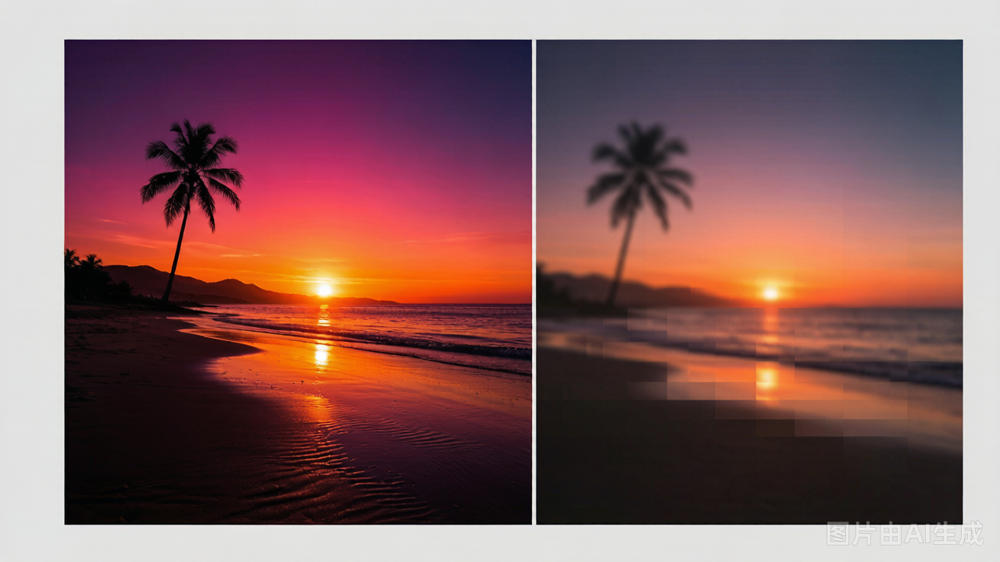
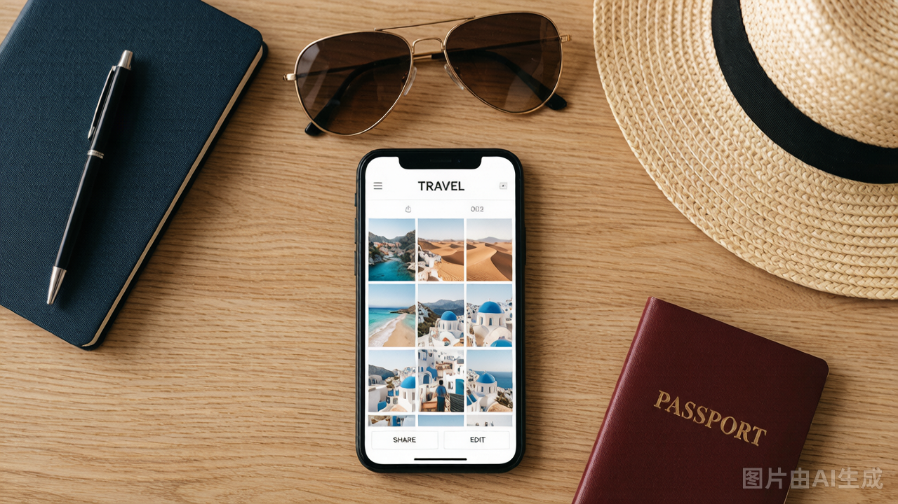

+++
date = '2026-06-20T10:00:00+02:00'
draft = false
title = "Cómo editar fotos de viaje para Instagram sin perder calidad | Guía 2026"
description = "Trucos para editar tus fotos de viaje en el móvil y subirlas a Instagram sin que pierdan calidad. Tamaños, formatos y consejos prácticos."
tags = ["instagram fotos", "viaje personal", "editar fotos móvil", "fotos redes"]
categories = ["Fotos de viaje", "Guías social"]

[cover]
  image = "cover.jpg"
  alt = "Editar fotos de viaje en el móvil para Instagram"
  caption = "Editar tus fotos antes de subirlas a Instagram marca la diferencia"
  relative = true
+++

## Introducción

La semana pasada volví de un viaje por la costa y me llevé un susto: las fotos se veían increíbles en el móvil, pero al subirlas a Instagram parecían borrosas, con colores lavados y menos definición. Si te ha pasado, no eres el único. Instagram comprime las imágenes al subirlas, y si no las preparas antes, el resultado es deprimente.

El truco está en editar tus fotos antes de subirlas y elegir bien el tamaño y el formato. No hace falta ser fotógrafa profesional ni tener apps de pago. Te cuento lo que a mí me funciona.

## Por qué Instagram estrope tus fotos de viaje

Instagram aplica su propia compresión a todo lo que subes. Si tu foto pesa 8 MB directamente de la cámara, Instagram la aplasta hasta unos 150 KB aproximadamente, y en ese proceso se pierde detalle, nitidez y color.

El problema no es solo el tamaño. Si subes una foto con una resolución rara, digamos 3500 píxeles de ancho, Instagram la redimensiona a 1080 píxeles y el redimensionado introduce artefactos. La foto se ve suave, sin textura, como si tuvieras un filtro de niebla que no pediste.

Lo que yo hago: antes de subir nada, paso mis fotos de viaje por <a href="https://comprimefotos.com">ComprimeFotos</a> y las dejo en 1080 píxeles de ancho con un peso de menos de 500 KB. Así Instagram no tiene que comprimir casi nada y la calidad se mantiene. Es un paso de dos minutos que cambia completamente el resultado.

## Cómo editar tus fotos de viaje antes de subirlas

Editar no significa poner filtros de revista. Significa preparar la foto para que Instagram la respete. Esto es lo que hago con cada foto de un viaje personal:

**1. Ajusta el brillo y el contraste.** Las fotos de viaje suelen tener cielos quemados o sombras oscuras. Sube el brillo un 10%, el contraste un 15%. No pases. Si subes demasiado, Instagram lo amplifica y la foto se ve pastelona.

**2. Satura con cuidado.** Un 5-10% basta. Si vas a la playa y subes la saturación al 30%, el agua se ve verde flúor y la arena rosa. Instagram ya de por sí intensifica los colores al comprimir, así que menos es más.

**3. Elige el tamaño correcto.** Instagram admite varias proporciones, pero la que mejor se ve en el feed es 1080x1080 (cuadrado) o 1080x1350 (vertical). Las horizontales (1080x608) se ven pequeñas en el móvil y pasan desapercibidas.

**4. Exporta en el formato adecuado.** JPG para fotos con muchos colores y degradados (paisajes, atardeceres). Si tu foto tiene zonas planas de color, tipo un cielo despejado o una pared blanca, puedes probar con formatos más eficientes, pero JPG sigue siendo el más compatible con Instagram.

Para comprimir sin perder calidad visible, uso <a href="https://comprimefotos.com">comprimefotos.com</a> porque lo hago todo desde el navegador del móvil, sin instalar nada. Subo la foto, elijo el tamaño y la descargo lista para Instagram. Rápido y limpio.

## Trucos extra para que tus fotos de viaje destaquen en redes

Aparte de la edición básica, hay detalles que marcan la diferencia entre una foto normal y una que tus amigos se paran a mirar:

**Piensa en la composición antes de disparar.** La regla de tercios funciona, pero no la uses siempre. A veces centrar el sujeto o jugar con simetrías da resultados más impactantes. Lo importante es que la foto tenga un punto de interés claro. Si todo compite por la atención, nada destaca.

**Cuidado con los contraluces.** Los atardeceres en el viaje son preciosos, pero si disparas contra el sol, tu cara queda oscura. Toca el foco en la pantalla del móvil antes de disparar y sube la exposición un toque. Edición posterior no resucita caras que no capturaste.

**Haz fotos en horizontal y recorta en vertical.** Disparar en horizontal te da margen para recortar en 4:5 después sin perder la parte interesante. Si disparas en vertical y luego quieres cuadrado, tienes que cortar demasiado.

**Revisa en la galería antes de subir.** A veces una foto se ve bien en la cámara y horrible en pantalla grande. Dale dos segundos en la galería del móvil antes de mandarla a Instagram.

## Preguntas frecuentes

**¿Puedo subir fotos de más de 1080 píxeles a Instagram?**

Sí, pero Instagram las redimensiona a 1080 píxeles de ancho. Si subes algo más grande, el redimensionado de Instagram puede introducir artefactos. Mejor subir ya a 1080 píxeles y controlar tú el resultado.

**¿Qué peso debe tener mi foto de viaje para Instagram?**

Menos de 500 KB es ideal. Si pesa más, Instagram la comprime agresivamente. Una foto entre 200-400 KB mantiene muy buena calidad visible.

**¿JPG o PNG para Instagram?**

JPG, sin duda. PNG pesa más y Instagram lo convierte igualmente, así que no ganas nada. PNG tiene sentido para logos o imágenes con zonas planas de color, pero para fotos de viaje, JPG siempre.

**¿Por qué mis fotos se ven diferentes en el ordenador y en el móvil?**

Cada pantalla tiene un nivel de brillo y una gama de color distinta. Las fotos que editas en el móvil se ven distintas en el ordenador y viceversa. Lo mejor: edita en el mismo dispositivo desde el que vas a subir a tus redes sociales.

**¿Cómo evito que Instagram me recorte la foto?**

Usa una proporción 4:5 (1080x1350) para fotos verticales o 1:1 (1080x1080) para cuadrados. Si subes algo más alto que 4:5, Instagram recorta la parte inferior.

## Conclusión

Preparar tus fotos de viaje antes de subirlas a Instagram no es complicado. Ajusta brillo y contraste, elige 1080 píxeles, exporta en JPG y comprime a menos de 500 KB. Dos minutos por foto y el resultado se nota muchísimo. ¡Anímate a probar con la próxima foto de tu viaje y verás la diferencia! 📸

  ✈️ <strong>Lucía</strong> — Fotógrafa viajera y editora de fotos con el móvil. Comparto lo que aprendo sobre fotos para Instagram, selfies y edición sin complicaciones. <a href="/autor/lucia/">Más sobre mí →</a>

